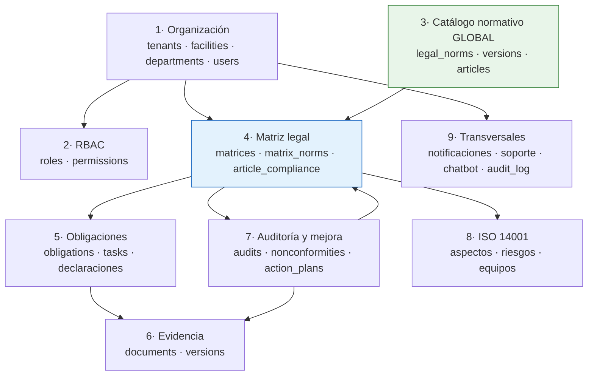
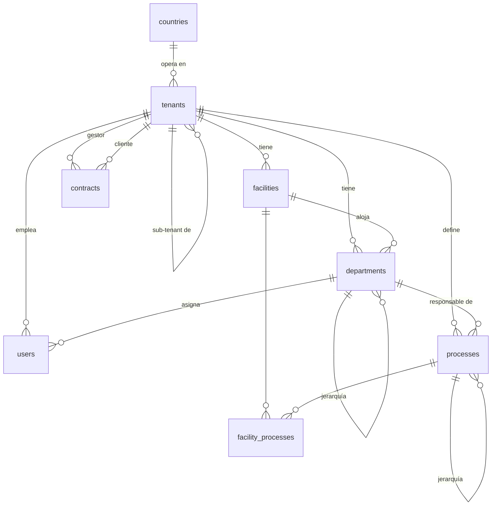
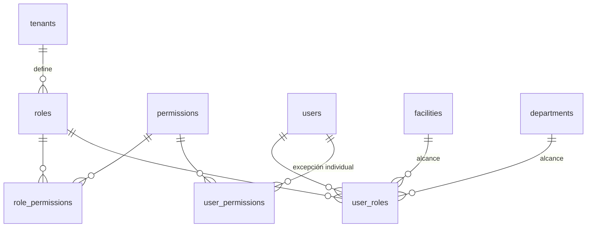
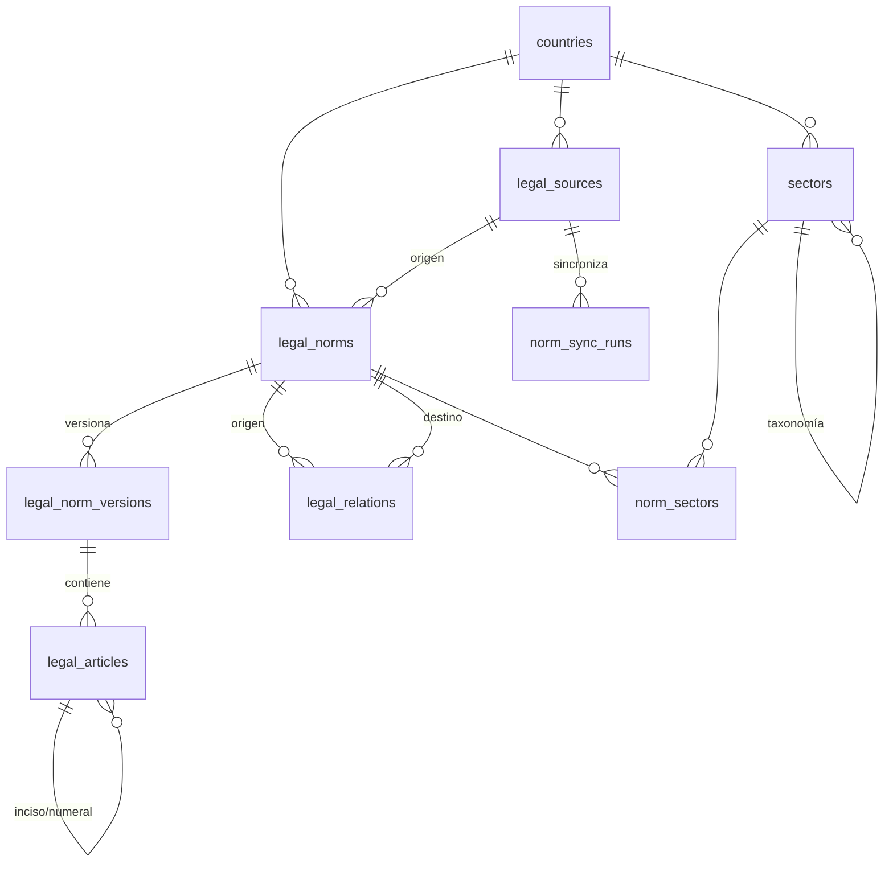
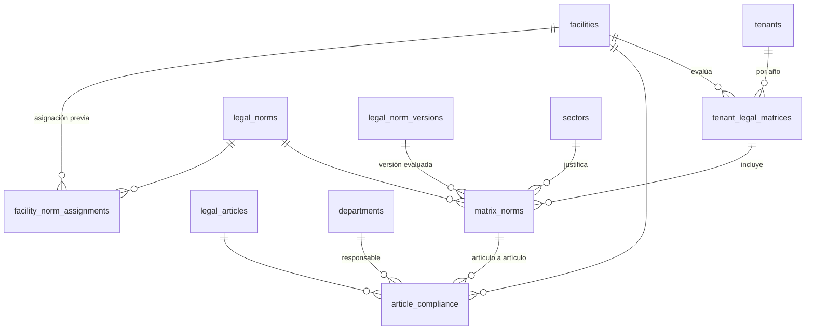
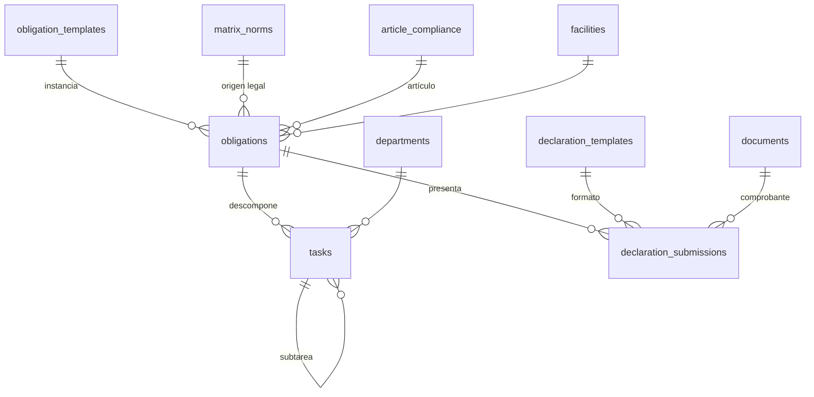
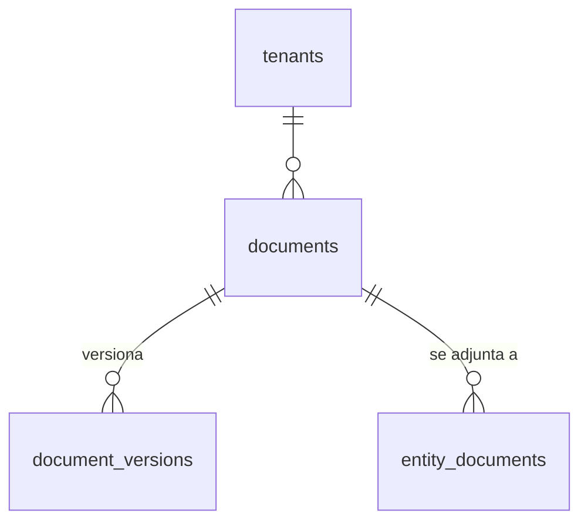
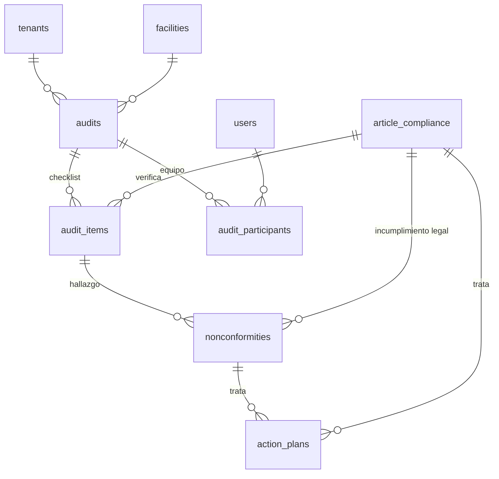
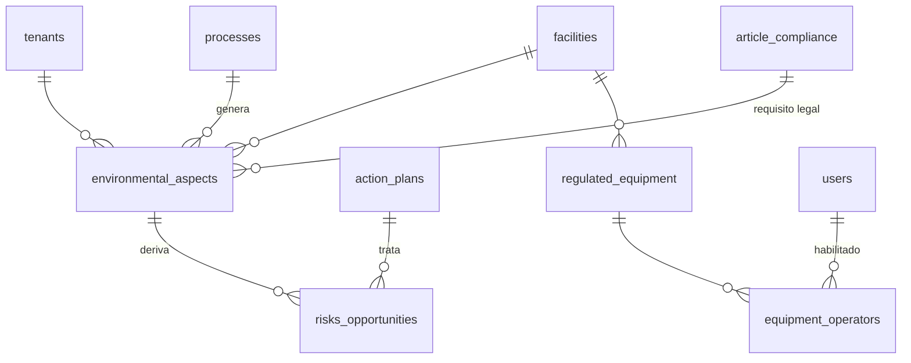
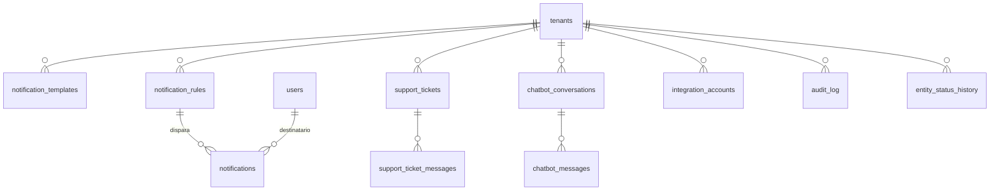

# Modelo entidad-relación — Ambienta

**Fuente de verdad:** [`db/01_schema.sql`](../../db/01_schema.sql). Este documento describe lo que ese archivo crea; si difieren, manda el SQL.

**52 tablas · 156 claves foráneas · RLS multi-tenant · PostgreSQL 16 + pgvector**

Los diagramas están agrupados por dominio porque un ER de 52 tablas en una sola imagen no se lee. Para no saturarlos se omiten las columnas de auditoría (`created_at/by`, `updated_at/by`, `deleted_at`), que existen en toda tabla de negocio.

---

## 1. Cómo se conectan los dominios



**La decisión estructural del modelo:** el catálogo normativo (verde) **no lleva `tenant_id`** — la ley es la misma para todos. La aplicabilidad y el cumplimiento sí son por empresa, y viven en la matriz legal (azul). Esa separación es lo que permite sincronizar BCN una vez y que sirva a todos los clientes.

---

## 2. Organización y multi-tenancy



`tenants.parent_tenant_id` registra la relación gestor → sub-tenant. **Un sub-tenant es un tenant real** con su propio aislamiento RLS, no una partición dentro del gestor. `contracts` formaliza el vínculo comercial entre ambos.

## 3. RBAC



39 permisos sembrados en `03_seed_catalogos.sql`. `user_roles` permite acotar un rol a una planta o departamento concreto, no solo a la empresa.

**Permiso efectivo**, en este orden:

1. Si hay fila en `user_permissions` para ese par (usuario, permiso), manda esa.
2. Si no, se une lo que otorguen sus roles vigentes en `user_roles`.
3. En ambos niveles, `granted = false` es denegación explícita y gana sobre cualquier concesión.

El paso 3 es lo que permite quitarle **un** permiso a alguien sin sacarlo del rol ni crear un rol de excepción (RF-12).

## 4. Catálogo normativo (global, sin `tenant_id`)



La cadena **norma → versión → artículo** es lo que permite evaluar cumplimiento a nivel de artículo y saber con qué texto vigente se evaluó. `legal_relations` modela modificaciones, derogaciones y concordancias entre normas — la estructura que entrega BCN.

## 5. Matriz legal y cumplimiento



**Este es el corazón del producto.** `facility_norm_assignments` es la asignación preliminar norma↔planta antes de entrar a una matriz anual formal; `article_compliance` es la evaluación concreta, con estado, riesgo, responsable y evidencia.

## 6. Obligaciones, tareas y declaraciones



`tasks` es el ticket único que alimenta Calendario, Gantt y Kanban — no hay tres entidades distintas para las tres vistas.

## 7. Documentos y evidencia



`entity_documents` es un vínculo polimórfico (`entity_type` + `entity_id`) que conecta un documento con cumplimiento, obligación, tarea, plan, auditoría, hallazgo o contrato. Los binarios **no** viven en PostgreSQL: `document_versions` guarda `storage_provider` + `storage_key`.

## 8. Auditoría y mejora



Una no conformidad puede nacer de un punto de auditoría **o** directamente de un artículo incumplido. El tratamiento por etapas vive hoy en la columna JSONB `nonconformities.improvement_stages`.

## 9. ISO 14001



Implementa la cadena de §6.1 de ISO 14001: **proceso → aspecto ambiental → riesgo/oportunidad → plan de acción**, con el requisito legal enganchado al aspecto.

## 10. Transversales



`audit_log` es append-only: el rol `ambienta_app` no tiene `UPDATE` ni `DELETE` sobre esa tabla. `entity_status_history` guarda el historial funcional de estados que se muestra en pantalla, distinto del log técnico.

---

## 11. Aislamiento multi-tenant

Dos barreras independientes:

1. **La aplicación** filtra por `tenant_id` en cada repositorio.
2. **RLS en PostgreSQL** existe para cuando la primera falle.

Para que la segunda funcione, la API abre cada transacción declarando el tenant:

```sql
SET LOCAL ROLE ambienta_app;
SELECT set_config('ambienta.tenant_id', '<uuid>', true);
```

Implementado en [`apps/api/app/deps.py`](../../apps/api/app/deps.py) (`get_tenant_db`). Dos detalles que importan:

- **El rol no puede ser superusuario.** `postgres` ignora RLS por completo: con esa conexión el aislamiento no existe aunque las policies estén.
- **Sin `ambienta.tenant_id` seteado, las consultas no devuelven filas.** Falla cerrado a propósito — es preferible una pantalla vacía a una fuga entre clientes.

Verificación: [`db/02_smoke_test.sql`](../../db/02_smoke_test.sql) corre 9 comprobaciones — aislamiento de lectura y escritura entre empresas, inmutabilidad del audit log, CHECK de negocio, unicidad por empresa, fallo cerrado sin tenant, unicidad de la matriz por periodo y permisos individuales. Hace `ROLLBACK` al final, así que se puede correr contra cualquier base sin ensuciarla.

---

## 12. Convenciones

| Regla | Detalle |
|---|---|
| Identificadores | `uuid` para entidades de negocio · `bigserial` para eventos · `smallserial` para catálogos |
| Tiempo | `timestamptz` para eventos · `date` para vigencias legales |
| Auditoría | `created_at/by` y `updated_at/by` en toda tabla de negocio; `updated_at` lo mantiene un trigger |
| Borrado | Lógico con `deleted_at` + índices parciales `WHERE deleted_at IS NULL` |
| Enumerados | `varchar` + `CHECK`, no tipos `ENUM` nativos — evolucionan sin migración de tipo |
| JSONB | Solo payload externo, snapshots y configuración; nunca reemplaza una FK |
| Sin `tenant_id` (14 tablas) | `tenants` — es la tabla de empresas, no lleva referencia a sí misma. Y el catálogo compartido: `countries`, `permissions`, `role_permissions`, `legal_sources`, `legal_norms`, `legal_norm_versions`, `legal_articles`, `legal_relations`, `sectors`, `norm_sectors`, `norm_sync_runs`, `obligation_templates`, `declaration_templates` |

---

## 13. Lo que el modelo todavía no cubre

Documentado para que no se confunda "no está" con "se olvidó":

- **Borrador v1.8 del Análisis Funcional** (RF-90 a RF-114): instrumentos de auditoría, checklist por cláusula, `Hallazgo` como entidad separada del registro de mejora, información documentada y colaboración. Tiene 9 decisiones abiertas; CLAUDE.md §1 exige spec aprobada antes de implementar.
- **Salidas reglamentarias de la gestión de mejoras**: modificar la matriz de riesgos corporativa, la matriz FODA y los procedimientos/instructivos del SGC. Hoy `risks_opportunities` cubre el riesgo **ambiental** de ISO 14001, no la matriz de riesgo corporativa por horizonte (corto/medio/largo plazo) ni el FODA de ISO 9001 §4.1.
- **Embeddings para el chatbot.** Hay `pgvector` instalado y `chatbot_messages.citations`, pero ninguna tabla con columna `vector` sobre `legal_articles` — el RAG no tiene de dónde recuperar todavía.
- **Escala de severidad configurable** (RF-100): hoy es un `CHECK` con `minor · major · critical`; el borrador v1.8 la quiere por empresa.
